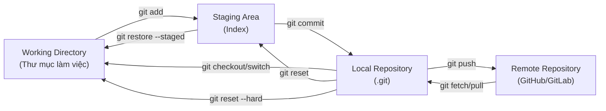

# Chương 3. Kiến trúc và mô hình làm việc của Git

Chương này giải thích cấu trúc kiến trúc bên trong của Git gồm ba cây (Three-Tree Architecture), mô tả chi tiết chức năng của từng vùng làm việc và vòng đời của một tập tin trong dự án.

## Mục lục

- [3.1 Kiến trúc ba cây (Three-Tree Architecture)](#31-kiến-trúc-ba-cây-three-tree-architecture)
- [3.2 Working Directory (Thư mục làm việc)](#32-working-directory-thư-mục-làm-việc)
- [3.3 Staging Area (Index)](#33-staging-area-index)
- [3.4 Local Repository (Kho lưu trữ cục bộ)](#34-local-repository-kho-lưu-trữ-cục-bộ)
- [3.5 Remote Repository (Kho lưu trữ từ xa)](#35-remote-repository-kho-lưu-trữ-từ-xa)
- [3.6 Chu trình làm việc của Git](#36-chu-trình-làm-việc-của-git)
- [3.7 Vòng đời tập tin (File Lifecycle)](#37-vòng-đời-tập-tin-file-lifecycle)

---

## 3.1 Kiến trúc ba cây (Three-Tree Architecture)

Git quản lý và theo dõi các tập tin của dự án thông qua ba khu vực lưu trữ logic chính (thường được ví như "ba cây"):



---

## 3.2 Working Directory (Thư mục làm việc)

- Thư mục vật lý trên ổ đĩa máy tính của bạn nơi chứa mã nguồn dự án.
- Nơi bạn trực tiếp tạo mới, sửa đổi hoặc xóa các tập tin.
- Chứa các tập tin được giải nén từ cơ sở dữ liệu của Git từ một commit cụ thể.
- Một tập tin ở đây được coi là ở trạng thái **Modified** nếu nó có sự thay đổi so với vùng Index hoặc HEAD commit hiện tại.

---

## 3.3 Staging Area (Index)

- Là một file nhị phân đơn giản nằm tại đường dẫn `.git/index`.
- Lưu trữ một **snapshot hoàn chỉnh** đại diện cho những gì sẽ được đưa vào commit tiếp theo (không phải lưu các phần khác biệt).
- Khi bạn chạy lệnh `git add file.txt`, Git sẽ băm nội dung file, tạo đối tượng blob mới trong thư mục `.git/objects/` và cập nhật thông tin tương ứng trong file Index.
- Giúp bạn có thể commit có chọn lọc thông qua các tùy chọn nâng cao như stage từng phần của tập tin (`git add -p`).

> [!TIP]
> **Staging Area** còn được gọi là "Index" hoặc "Cache" (tên cũ). Chữ ký của cấu trúc file Index nội bộ vẫn là "DIRC" — dircache.

---

## 3.4 Local Repository (Kho lưu trữ cục bộ)

- Chính là thư mục ẩn `.git/` nằm ở thư mục gốc của dự án. Chứa:
  - **Object Store** (`.git/objects/`): Nơi lưu trữ tất cả các blob, tree, commit, tag đã được nén zlib.
  - **References** (`.git/refs/`): Các file text chứa con trỏ trỏ đến commit cụ thể (các nhánh - branches, tags và con trỏ HEAD).
  - **Config** (`.git/config`): File text chứa cấu hình cụ thể của repository này.
  - **Hooks** (`.git/hooks/`): Các đoạn script tự động kích hoạt trước/sau các hành động Git cụ thể.

---

## 3.5 Remote Repository (Kho lưu trữ từ xa)

- Một bản sao của repository được đặt trên máy chủ đám mây hoặc máy chủ mạng nội bộ (như GitHub, GitLab, Bitbucket, tự dựng server Git...).
- Đồng bộ dữ liệu qua lại với Local Repository bằng các lệnh: `git push`, `git fetch`, `git pull`.
- **origin**: Tên gọi mặc định của remote repository đầu tiên khi bạn thực hiện clone dự án về máy.
- **upstream**: Thường dùng để chỉ nhánh ở kho từ xa mà nhánh cục bộ của bạn đang theo dõi (tracking).

---

## 3.6 Chu trình làm việc của Git

Sơ đồ thể hiện luồng di chuyển dữ liệu giữa các vùng làm việc của Git:

```text
      Working Directory           Index (Staging)        Local Repository         Remote Repository
         (Sửa file)             (Chuẩn bị commit)        (Lịch sử local)              (Server)
             │                        │                        │                        │
             │──── git add ──────────>│                        │                        │
             │                        │──── git commit ───────>│                        │
             │                        │                        │──── git push ──────────>│
             │<── git pull/fetch ────────────────────────────│<─────── git push ────────│
             │                        │<── git reset/restore──│<── git reset --soft ─────│
             │<── git restore ────────│                        │                        │
```

---

## 3.7 Vòng đời tập tin (File Lifecycle)

Trong quá trình làm việc với Git, các tập tin sẽ luân chuyển qua các trạng thái khác nhau:

| Trạng thái | Vùng lưu trữ hiện tại | Ý nghĩa |
| :--- | :--- | :--- |
| **Untracked** | Chỉ có ở Working Directory | File mới được tạo ra, Git chưa từng theo dõi lịch sử của file này. |
| **Unmodified** | Working Directory khớp với Repository | File đã được tracking và không có thay đổi nào so với commit gần nhất. |
| **Modified** | Working Directory khác với Index | File đã được thay đổi nội dung nhưng chưa được đưa vào vùng chờ (Stage). |
| **Staged** | Index khác với Repository | File thay đổi đã được đưa vào vùng chờ, sẵn sàng cho lần commit kế tiếp. |
| **Committed** | Đã được ghi nhận vào Repository | File đã được lưu trữ vĩnh viễn và an toàn vào lịch sử của Git database. |

---
[← Quay lại mục lục](README.md)
