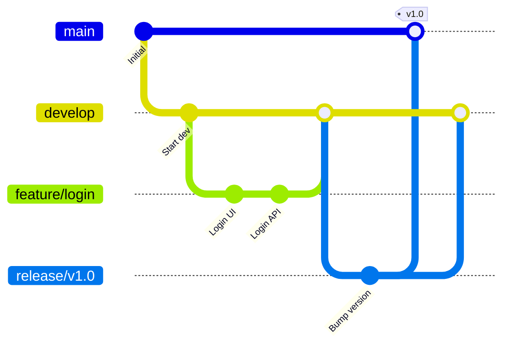

# Chương 10. Workflows, Git nâng cao & Best Practices

Chương này tổng hợp toàn bộ quy trình làm việc cộng tác trên GitHub, các mô hình phân nhánh phổ biến, công cụ Git nâng cao và các quy chuẩn ứng xử tốt nhất (Best Practices) để phát triển phần mềm chuyên nghiệp.

## Mục lục

- [10.1 Quy trình GitHub Workflow & Pull Request](#101-quy-trình-github-workflow--pull-request)
- [10.2 Các mô hình Workflow & Chiến lược gộp](#102-các-mô-hình-workflow--chiến-lược-gộp)
- [10.3 Công cụ & Kỹ thuật Git nâng cao](#103-công-cụ--kỹ-thuật-git-nâng-cao)
- [10.4 Git Best Practices & Bảo mật](#104-git-best-practices--bảo-mật)

---

## 10.1 Quy trình GitHub Workflow & Pull Request

GitHub Workflow là quy trình tiêu chuẩn giúp các đội ngũ phát triển phần mềm cộng tác và đóng góp mã nguồn an toàn, hiệu quả.

Sơ đồ tuần tự các bước làm việc từ Fork repository đến Merge Pull Request:

```mermaid
flowchart LR
    accTitle: Quy trình GitHub Workflow
    accDescr: Sơ đồ luồng 9 bước hợp nhất mã nguồn chuẩn mực trên GitHub.
    nodeFork["1. Fork repo"] --> nodeClone["2. Clone local"]
    nodeClone --> nodeBranch["3. Tạo branch"]
    nodeBranch --> nodeCommit["4. Commit code"]
    nodeCommit --> nodePush["5. Push remote"]
    nodePush --> nodePR["6. Mở PR"]
    nodePR --> nodeReview["7. Code Review"]
    nodeReview --> nodeMerge["8. Merge PR"]
    nodeMerge --> nodeClean["9. Xóa branch"]
```



Bảng giải thích các bước chính trong chu trình cộng tác:

| Thành phần/Bước | Vai trò/Mô tả | Chi tiết |
| :--- | :--- | :--- |
| **Fork & Clone** | Tải mã nguồn về máy | Fork repository gốc về tài khoản cá nhân, dùng `git clone <url>` để làm việc cục bộ. |
| **Branch & Commit** | Lập trình tính năng độc lập | Tạo nhánh `feature/<name>`, thực hiện chỉnh sửa và lưu snapshot qua `git commit -m`. |
| **Push & PR** | Đề xuất gộp code | Đẩy nhánh lên server qua `git push -u origin <branch>` và mở Pull Request (PR). |
| **Review & Merge** | Kiểm duyệt và tích hợp | Đội ngũ review code, chạy kiểm thử tự động, sau đó cấp duyệt (Approve) và bấm Merge. |

Lệnh Git khởi tạo và làm việc với nhánh tính năng:

```bash
# Sao chép kho lưu trữ cá nhân về máy và tạo nhánh làm việc mới
git clone https://github.com/YOUR_USERNAME/repo.git
git switch -c feature/awesome-feature

# Lưu trạng thái chỉnh sửa và đẩy nhánh lên GitHub
git add .
git commit -m "feat: add awesome feature"
git push -u origin feature/awesome-feature
```

Các hình thức Merge PR chính trên GitHub:
- **Squash and merge**: Gộp tất cả commit của nhánh feature thành 1 commit duy nhất trên `main`, giúp lịch sử gọn gàng.
- **Rebase and merge**: Phát lại từng commit riêng lẻ lên đầu nhánh `main`, giữ lịch sử tuyến tính không có commit merge.
- **Create a merge commit**: Giữ nguyên toàn bộ cấu trúc các nhánh và tự động tạo 1 commit merge hợp nhất.

---

## 10.2 Các mô hình Workflow & Chiến lược gộp

Phân tích các mô hình phân nhánh (Workflows) phổ biến trong dự án phần mềm và chiến lược lựa chọn cách gộp code.

Sơ đồ phân nhánh và vòng đời commit theo mô hình Git Flow:



Bảng so sánh 6 mô hình Workflow phát triển phần mềm:

| Thành phần/Bước | Vai trò/Mô tả | Chi tiết |
| :--- | :--- | :--- |
| **Centralized** | Mô hình tập trung 1 nhánh | Tất cả commit trực tiếp lên `main`. Phù hợp nhóm 1-3 người hoặc dự án chuyển từ SVN. |
| **Feature Branch** | Nhánh tính năng riêng biệt | Mỗi tính năng tạo 1 nhánh, gộp qua PR. Phù hợp đa số dự án tiêu chuẩn. |
| **Git Flow** | Quản lý 5 loại nhánh nghiêm ngặt | Dùng `main`, `develop`, `feature`, `release`, `hotfix`. Phù hợp phần mềm đóng gói sản phẩm. |
| **GitHub Flow** | Tích hợp liên tục vào `main` | Nhánh `main` luôn sẵn sàng deploy. Phù hợp web app, dịch vụ SaaS, Continuous Delivery. |
| **GitLab Flow** | Quản lý theo môi trường | Code đi qua các nhánh môi trường (`staging`, `production`). Phù hợp hệ thống có nhiều máy chủ thử nghiệm. |
| **Trunk-Based (TBD)**| Gộp code liên tục hàng ngày | Nhánh tính năng sống dưới 1 ngày, dùng **Feature Flags** để ẩn code dở dang. Phù hợp DevOps hiệu năng cao. |

> [!NOTE]
> Báo cáo **DORA** chỉ ra rằng 89% đội ngũ hiệu năng cao áp dụng Trunk-Based Development, giúp tăng tần suất deployment gấp **182 lần** và giảm lead time gấp **127 lần**.

> [!WARNING]
> Trunk-Based Development đòi hỏi hệ thống kiểm thử tự động (CI) vô cùng nghiêm ngặt. Thiếu test tự động đáng tin cậy sẽ dẫn đến việc phá hỏng môi trường production liên tục.

Cây quyết định chiến lược gộp nhánh (Merge Strategy Decision Tree):

```text
Nhánh có được chia sẻ cho người khác làm chung không?
├── Có → Dùng git merge thông thường (--no-ff) để bảo toàn lịch sử.
└── Không (Chỉ có bạn làm việc trên nhánh này)
    ├── Muốn 1 commit duy nhất trên nhánh chính? → Squash Merge.
    └── Muốn giữ lại các commit chi tiết riêng lẻ?
        ├── Commits có ý nghĩa rõ ràng → Rebase rồi Fast-forward Merge.
        └── Commits chứa nhiều commit nháp (WIP) → Dùng git rebase -i dọn dẹp trước khi merge.
```

---

## 10.3 Công cụ & Kỹ thuật Git nâng cao

Các công cụ mạnh mẽ phục vụ quản lý dự án phức tạp, gỡ lỗi nhị phân, nhúng thư viện ngoài và tự động hóa.

Bảng tổng hợp công cụ và tính năng Git nâng cao:

| Thành phần/Bước | Vai trò/Mô tả | Chi tiết |
| :--- | :--- | :--- |
| **`git stash`** | Tạm cất thay đổi dở dang | Dùng `git stash push -m "msg"` để làm sạch Working Directory, lấy lại bằng `git stash pop`. |
| **`git tag`** | Gắn mốc phiên bản | Tạo `git tag -a v1.0.0 -m "msg"` (Annotated Tag) lưu đầy đủ tác giả, ngày tháng và thông điệp. |
| **`git bisect`** | Tìm bug bằng thuật toán nhị phân | Khoanh vùng commit gây lỗi trong $O(\log N)$ bước qua `git bisect start HEAD v1.0` hoặc tự động với `git bisect run`. |
| **`git blame`** | Truy vết tác giả dòng code | Kiểm tra ai sửa dòng code nào lần cuối bằng `git blame -L 10,20 file.txt`. |
| **`git archive`** | Đóng gói mã nguồn | Xuất mã nguồn sạch không chứa `.git/` ra file nén qua `git archive --format=zip --output=app.zip main`. |
| **Git LFS** | Quản lý file nhị phân lớn | Thay file lớn bằng file text pointer siêu nhẹ qua `git lfs track "*.psd"`. |

Cấu hình Git Hooks tự động hóa quy trình:
- **Client-side Hooks** (`.git/hooks/`): `pre-commit` (chạy linter/test), `commit-msg` (kiểm tra cú pháp message), `pre-push` (chạy test tích hợp).
- **Server-side Hooks**: `pre-receive` (chặn code lỗi/secrets), `post-receive` (kích hoạt CI/CD).

> [!TIP]
> Thư mục `.git/hooks/` không được push lên remote. Nên sử dụng công cụ **Husky** (Node.js) hoặc **pre-commit** (Python) để chia sẻ hook cho cả đội ngũ.

Bảng so sánh giải pháp nhúng mã nguồn Git Submodule và Git Subtree:

| Đặc tính | **Git Submodule** | **Git Subtree** |
| :--- | :--- | :--- |
| **Bản chất lưu trữ** | Chỉ lưu liên kết con trỏ (`pointer`) trỏ sang commit của repo nhúng | Sao chép trực tiếp toàn bộ file và lịch sử của repo nhúng vào repo chính |
| **Độ phức tạp clone** | Phức tạp (cần chạy thêm `git submodule update --init --recursive`) | Đơn giản (clone thông thường như thư mục code vật lý) |
| **Ảnh hưởng dung lượng**| Siêu nhẹ (không làm tăng dung lượng repo chính) | Làm phình dung lượng repo chính do chứa cả lịch sử repo nhúng |

---

## 10.4 Git Best Practices & Bảo mật

Quy chuẩn viết commit message, phân loại nhánh, bảo vệ thông tin nhạy cảm và chiến lược sao lưu an toàn.

Quy tắc viết Commit Message (Quy tắc 50/72):
- **Subject**: Tối đa 50 ký tự, thể mệnh lệnh (*"Add feature"*), không viết dấu chấm cuối câu, cách thân 1 dòng trống.
- **Body**: Xuống dòng tự động tại 72 ký tự để hiển thị chuẩn trên terminal.

Bảng tra cứu loại commit và mối liên hệ với Semantic Versioning (SemVer: `MAJOR.MINOR.PATCH`):

| Thành phần/Bước | Vai trò/Mô tả | Chi tiết |
| :--- | :--- | :--- |
| **`feat`** | Thêm tính năng mới | Tăng số **MINOR** (ví dụ: `1.1.0`). |
| **`fix`** | Sửa lỗi chương trình | Tăng số **PATCH** (ví dụ: `1.0.1`). |
| **`BREAKING CHANGE`** | Thay đổi API không tương thích (ký tự `!`) | Tăng số **MAJOR** (ví dụ: `2.0.0`). |
| **`docs` / `refactor` / `perf`** | Tài liệu / Tái cấu trúc / Tối ưu | KHÔNG nâng phiên bản phần mềm. |
| **`test` / `ci` / `chore`** | Thử nghiệm / Cấu hình CI / Bảo trì | KHÔNG nâng phiên bản phần mềm. |

Ví dụ một commit message chuẩn mực:

```text
feat(api): add user authentication endpoint

Implement JWT-based authentication with refresh token support.
- POST /auth/login for user login
- POST /auth/refresh for token refresh

Closes #123
```

Bảng quy ước đặt tên nhánh (Branch Naming):

| Thành phần/Bước | Vai trò/Mô tả | Chi tiết |
| :--- | :--- | :--- |
| **`feature/xxx`** | Phát triển tính năng mới | Ví dụ: `feature/jwt-auth`. |
| **`fix/xxx`** | Sửa lỗi thông thường | Ví dụ: `fix/login-null-pointer`. |
| **`hotfix/xxx`** | Sửa lỗi khẩn cấp trên production | Ví dụ: `hotfix/payment-gateway-timeout`. |
| **`release/xxx`** | Đóng gói phiên bản phát hành | Ví dụ: `release/v1.2.0`. |
| **`chore/xxx`** | Bảo trì, cập nhật cấu hình | Ví dụ: `chore/update-dependencies`. |

Quy trình bảo mật Secret với 3 lớp phòng thủ:
1. **Lớp 1 (Pre-commit hook)**: Cài đặt **Gitleaks** hoặc GitGuardian CLI quét secret cục bộ trước khi commit.
2. **Lớp 2 (Push protection)**: Bật tính năng Push Protection trên GitHub/GitLab để chặn không cho push code chứa secret.
3. **Lớp 3 (CI Scanning)**: Tự động chạy bài quét bảo mật trên pipeline CI/CD cho mọi PR.

> [!WARNING]
> Theo GitGuardian, đã phát hiện **23.8 triệu secrets** bị lộ công khai trên GitHub, trong đó 70% secret vẫn đang hoạt động.

Cấu hình mẫu tập tin loại trừ `.gitignore`:

```gitignore
# Secret và cấu hình môi trường
.env
.env.*
*.pem
*.key

# Thư mục dependencies & kết quả build
node_modules/
vendor/
.venv/
dist/
build/
target/

# Tập tin rác IDE & OS
.vscode/
.idea/
.DS_Store
Thumbs.db
*.log
```

Chiến lược sao lưu và Force Push an toàn:
- **Commit & PR nhỏ**: Chia nhỏ thay đổi (PR dưới 400 dòng code) giúp quá trình review và đảo ngược code an toàn.
- **Sao lưu đa máy chủ & Offline**: Push song song lên 2 remote server độc lập và dùng `git bundle` tạo file nhị phân sao lưu offline.
- **Force Push an toàn**:
  ```bash
  # Chạy force push có kiểm tra commit mới ở phía remote trước khi ghi đè
  git push --force-with-lease --force-if-includes
  ```

---
[← Quay lại mục lục](README.md)
