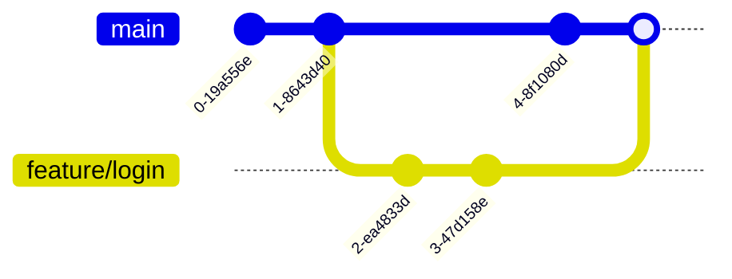

# Chương 8. Quản lý Branch

Chương này trình bày khái niệm về nhánh (Branch) — một trong những tính năng mạnh mẽ nhất giúp Git vượt trội hơn các VCS khác, cách tạo, chuyển đổi, hợp nhất nhánh (Merge), giải quyết xung đột (Merge Conflict), dời gốc nhánh (Rebase) và lấy commit cụ thể (Cherry-pick).

## Mục lục

- [8.1 Branch là gì?](#81-branch-là-gì)
- [8.2 Git lưu trữ Branch như thế nào?](#82-git-lưu-trữ-branch-như-thế-nào)
- [8.3 Con trỏ HEAD là gì?](#83-con-trỏ-head-là-gì)
- [8.4 Tạo Branch mới](#84-tạo-branch-mới)
- [8.5 Chuyển đổi giữa các Branch](#85-chuyển-đổi-giữa-các-branch)
- [8.6 Hợp nhất Branch (Merge)](#86-hợp-nhất-branch-merge)
- [8.7 Cơ chế Fast-Forward Merge](#87-cơ-chế-fast-forward-merge)
- [8.8 Cơ chế Three-way Merge](#88-cơ-chế-three-way-merge)
- [8.9 Xử lý xung đột hợp nhất (Merge Conflict)](#89-xử-lý-xung-đột-hợp-nhất-merge-conflict)
- [8.10 Dời gốc nhánh (Rebase)](#810-dời-gốc-nhánh-rebase)
- [8.11 Lấy commit cụ thể (Cherry-pick)](#811-lấy-commit-cụ-thể-cherry-pick)

---

## 8.1 Branch là gì?

**Branch (nhánh)** trong Git là một con trỏ di động trỏ đến một commit cụ thể. Nó cho phép bạn tách biệt luồng code của mình ra khỏi luồng chính để thử nghiệm tính năng hoặc sửa lỗi độc lập mà không ảnh hưởng đến người khác.



> [!TIP]
> Một nhánh trong Git **chỉ là một file text nhỏ dung lượng 41 bytes** (chứa 40 ký tự mã hash commit + 1 ký tự xuống dòng). Do đó việc tạo hàng trăm nhánh trong Git chỉ tốn khoảng 4KB dung lượng đĩa và diễn ra ngay lập tức, không sao chép bất kỳ file mã nguồn vật lý nào.

---

## 8.2 Git lưu trữ Branch như thế nào?

- Các tham chiếu nhánh local được lưu tại thư mục `.git/refs/heads/`.
- Khi bạn đứng ở một nhánh và tạo commit mới, Git tự động cập nhật file tham chiếu của nhánh đó trỏ sang mã hash SHA-1 của commit mới vừa được tạo.

---

## 8.3 Con trỏ HEAD là gì?

**HEAD** là một con trỏ đặc biệt dùng để đánh dấu vị trí làm việc hiện tại của bạn trong dự án (giống như ký hiệu *"You are here"* trên bản đồ).

- Thông thường, `HEAD` sẽ trỏ đến nhánh hiện tại (ví dụ: `HEAD` trỏ vào `refs/heads/main` → trỏ vào commit hash). Đây gọi là trạng thái **Attached HEAD**.
- Nếu bạn checkout trực tiếp về một commit hash cụ thể thay vì một nhánh, `HEAD` sẽ trỏ trực tiếp vào commit hash đó. Đây được gọi là trạng thái **Detached HEAD** (trạng thái trôi nổi).

---

## 8.4 Tạo Branch mới

Tạo một con trỏ nhánh mới trỏ cùng vào commit hiện tại của bạn:
```bash
# Tạo nhánh mới có tên 'feature-x'
git branch feature-x

# Tạo nhánh mới và tự động chuyển sang nhánh đó ngay lập tức (khuyên dùng)
git switch -c feature-x

# Cú pháp cũ (legacy)
git checkout -b feature-x
```

---

## 8.5 Chuyển đổi giữa các Branch

Thay đổi con trỏ HEAD trỏ sang nhánh khác và cập nhật thư mục làm việc của bạn khớp với nhánh đó:
```bash
# Chuyển sang nhánh 'main' (cú pháp hiện đại từ bản Git 2.23+)
git switch main

# Quay lại nhánh vừa đứng trước đó
git switch -

# Cú pháp cũ (legacy)
git checkout main
```

---

## 8.6 Hợp nhất Branch (Merge)

Gộp lịch sử phát triển của một nhánh khác vào nhánh hiện tại:
```bash
# Đầu tiên cần chuyển về nhánh nhận code gộp (ví dụ: main)
git switch main

# Tiến hành hợp nhất nhánh 'feature-x' vào 'main'
git merge feature-x

# Luôn tạo một commit merge mới (ngay cả khi có thể chạy fast-forward) để giữ vết topo
git merge --no-ff feature-x
```

---

## 8.7 Cơ chế Fast-Forward Merge

Xảy ra khi nhánh đích không có bất kỳ commit mới nào kể từ khi bạn tách nhánh feature. Lúc này Git chỉ cần di chuyển con trỏ nhánh đích tiến thẳng đến commit cuối cùng của nhánh feature mà không cần tạo commit merge mới.

**Trước khi merge:**
```text
main:    A---B---C
                  \
feature:          D---E
```

**Sau khi merge (chỉ dịch chuyển con trỏ `main` sang `E`):**
```text
main, feature: A---B---C---D---E
```

---

## 8.8 Cơ chế Three-way Merge

Xảy ra khi cả hai nhánh đều có những commit mới độc lập kể từ khi tách nhánh. Lúc này Git sẽ sử dụng 3 snapshot để thực hiện gộp: (1) Commit tổ tiên chung gần nhất (Ancestor), (2) Commit cuối cùng của nhánh đích, (3) Commit cuối cùng của nhánh nguồn gộp. Git sẽ tự động tạo một commit merge mới đại diện cho kết quả gộp này.

**Trước khi merge:**
```text
main:    A---B---C---F
                  \
feature:          D---E
```

**Sau khi merge (Tạo commit merge `G`):**
```text
main:    A---B---C---F---G
                  \     /
feature:          D---E
```

---

## 8.9 Xử lý xung đột hợp nhất (Merge Conflict)

Xảy ra khi cùng một dòng trong một tập tin bị sửa đổi khác nhau ở hai nhánh mà bạn đang muốn gộp lại. Git sẽ tạm dừng quá trình merge và đánh dấu vùng xung đột trong file:

```text
<<<<<<< HEAD
Dòng code ở nhánh hiện tại của bạn
=======
Dòng code ở nhánh nguồn gộp (ví dụ: feature-x)
>>>>>>> feature-x
```

**Quy trình giải quyết:**
1. Mở file bị xung đột, chỉnh sửa thủ công để chọn code đúng (hoặc giữ cả hai) và xóa các ký tự đánh dấu xung đột (`<<<<<<<`, `=======`, `>>>>>>>`).
2. Chạy lệnh:
   ```bash
   git add <tập-tin-đã-sửa>
   git merge --continue
   ```
3. Nếu muốn hủy hoàn toàn hành động merge hiện tại:
   ```bash
   git merge --abort
   ```

---

## 8.10 Dời gốc nhánh (Rebase)

Rebase là hành động lấy toàn bộ các commit mới ở nhánh của bạn và "phát lại" (reapply) chúng tuần tự lên trên đỉnh của một nhánh khác. Lợi ích là tạo ra một lịch sử commit thẳng tắp, không có các commit merge thừa thãi.

```bash
# Chuyển sang nhánh feature cần rebase
git switch feature-branch

# Tiến hành rebase lên trên đỉnh của nhánh 'main'
git rebase main
```

> [!CAUTION]
> **Quy tắc vàng của Rebase**: KHÔNG BAO GIỜ rebase các commit đã được push lên remote repository và chia sẻ cho người khác cùng làm việc. Việc này sẽ viết lại lịch sử (tạo commit hash mới) và gây hỗn loạn lịch sử của những người cộng tác chung.

---

## 8.11 Lấy commit cụ thể (Cherry-pick)

Lệnh `cherry-pick` cho phép bạn lựa chọn một hoặc một vài commit cụ thể từ một nhánh bất kỳ và áp dụng trực tiếp lên trên đầu của nhánh hiện tại.

```bash
# Áp dụng một commit cụ thể
git cherry-pick abc1234

# Áp dụng nhiều commit rời rạc
git cherry-pick abc1234 def5678

# Áp dụng một dải commit từ a đến b (không bao gồm commit a)
git cherry-pick a^..b
```

---
[← Quay lại mục lục](README.md)
