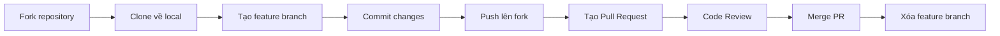

# Chương 10. GitHub Workflow

Chương này hướng dẫn quy trình làm việc chuẩn mực trên GitHub (GitHub Workflow) — quy trình được hàng triệu lập trình viên và doanh nghiệp áp dụng để cộng tác và đóng góp mã nguồn hiệu quả.

## Mục lục

- [Quy trình GitHub Workflow tổng quan](#quy-trình-github-workflow-tổng-quan)
- [11.1 Fork (Phân nhánh dự án)](#111-fork-phân-nhánh-dự-án)
- [11.2 Clone (Sao chép repo)](#112-clone-sao-chép-repo)
- [11.3 Branch (Tạo nhánh mới)](#113-branch-tạo-nhánh-mới)
- [11.4 Commit (Lưu thay đổi)](#114-commit-lưu-thay-đổi)
- [11.5 Push (Gửi code lên server)](#115-push-gửi-code-lên-server)
- [11.6 Pull Request (Đề xuất gộp code)](#116-pull-request-đề-xuất-gộp-code)
- [11.7 Code Review (Đánh giá code)](#117-code-review-đánh-giá-code)
- [11.8 Merge (Hợp nhất code)](#118-merge-hợp-nhất-code)

---

## Quy trình GitHub Workflow tổng quan

Dưới đây là sơ đồ các bước cơ bản trong quy trình cộng tác trên GitHub:



---

## 11.1 Fork (Phân nhánh dự án)

Hành động tạo một bản sao độc lập của repository (của người khác hoặc của tổ chức chung) về tài khoản GitHub cá nhân của bạn. Bản sao này giúp bạn thoải mái sửa đổi code mà không sợ làm hỏng dự án gốc.

---

## 11.2 Clone (Sao chép repo)

Tải repository đã được Fork ở bước trên từ tài khoản GitHub cá nhân về máy tính cục bộ để bắt đầu lập trình:

```bash
git clone https://github.com/YOUR_USERNAME/repo.git
```

---

## 11.3 Branch (Tạo nhánh mới)

Luôn tạo một nhánh mới đại diện cho tính năng bạn sắp phát triển thay vì làm việc trực tiếp trên nhánh `main`:

```bash
git switch -c feature/awesome-feature
```

---

## 11.4 Commit (Lưu thay đổi)

Thực hiện chỉnh sửa mã nguồn và lưu lại trạng thái (commit) cục bộ kèm mô tả ý nghĩa:

```bash
git add .
git commit -m "feat: add awesome feature"
```

---

## 11.5 Push (Gửi code lên server)

Gửi nhánh chứa code mới của bạn lên repository cá nhân trên GitHub:

```bash
git push -u origin feature/awesome-feature
```

---

## 11.6 Pull Request (Đề xuất gộp code)

Truy cập giao diện web GitHub của dự án gốc, tiến hành mở một **Pull Request (PR)** từ nhánh của repository cá nhân bạn trỏ đến nhánh đích của repository gốc. Điền mô tả chi tiết, liên kết issue liên quan và đính kèm ảnh chụp màn hình minh họa (nếu có).

---

## 11.7 Code Review (Đánh giá code)

Các thành viên khác trong đội ngũ (Reviewers) sẽ kiểm tra, viết nhận xét bình luận trực tiếp trên dòng code của bạn. Nếu có yêu cầu chỉnh sửa (Request Changes), bạn tiếp tục code sửa đổi ở máy cục bộ và push commit mới lên cùng nhánh đó. PR trên GitHub sẽ tự động cập nhật.

---

## 11.8 Merge (Hợp nhất code)

Sau khi nhận được sự đồng thuận (Approve) từ các Reviewers và vượt qua các bài test tự động (GitHub Actions), người quản lý dự án sẽ bấm nút hợp nhất (Merge) PR của bạn vào luồng code chính.

**Các hình thức Merge phổ biến trên GitHub:**
- **Squash and merge**: Gộp toàn bộ các commit vụn vặt ở nhánh feature thành một commit duy nhất khi merge. Giúp lịch sử nhánh chính gọn gàng.
- **Rebase and merge**: Phát lại từng commit riêng lẻ lên nhánh chính mà không tạo commit merge.
- **Create a merge commit**: Hợp nhất thông thường và tự động tạo một commit merge mới, bảo toàn sơ đồ mạng lưới các nhánh (git topology).

---
[← Quay lại mục lục](README.md)
