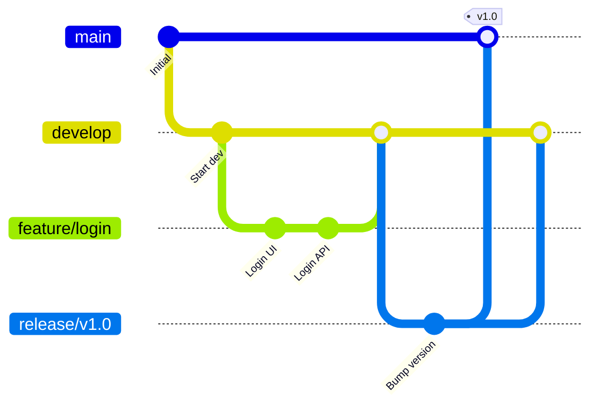

# Chương 12. Các Workflow phổ biến

Chương này phân tích các mô hình quy trình làm việc (Workflows) phổ biến trong dự án phần mềm, từ đơn giản đến phức tạp, và hướng dẫn cách chọn chiến lược gộp code tối ưu.

## Mục lục

- [12.1 Centralized Workflow](#121-centralized-workflow)
- [12.2 Feature Branch Workflow](#122-feature-branch-workflow)
- [12.3 Git Flow](#123-git-flow)
- [12.4 GitHub Flow](#124-github-flow)
- [12.5 GitLab Flow](#125-gitlab-flow)
- [12.6 Trunk-Based Development (TBD)](#126-trunk-based-development-tbd)
- [12.7 Cây quyết định chiến lược gộp (Merge Strategy Decision Tree)](#127-cây-quyết-định-chiến-lược-gộp-merge-strategy-decision-tree)

---

## 12.1 Centralized Workflow

- **Nguyên lý**: Chỉ sử dụng duy nhất một nhánh `main` (hoặc `master`). Tất cả các lập trình viên commit code trực tiếp lên nhánh này (tương tự như mô hình làm việc của SVN).
- **Phù hợp**: Nhóm dự án siêu nhỏ (1 - 3 người), hoặc khi doanh nghiệp đang thực hiện chuyển dịch code từ SVN sang Git và chưa quen với khái niệm phân nhánh.

---

## 12.2 Feature Branch Workflow

- **Nguyên lý**: Mỗi khi phát triển tính năng mới, lập trình viên bắt buộc phải tạo một nhánh riêng biệt trỏ ra từ `main`. Sau khi hoàn thành, họ sẽ đẩy nhánh này lên server và gộp lại vào nhánh chính thông qua quy trình tạo Pull Request sau khi được review.
- **Phù hợp**: Hầu hết các dự án và đội ngũ phát triển phần mềm hiện nay.

---

## 12.3 Git Flow

Quy trình phân nhánh cổ điển, được định nghĩa bởi Vincent Driessen vào năm 2010. Mô hình này sử dụng các nhánh có vòng đời và vai trò được xác định nghiêm ngặt:



**Mô hình quy định 5 loại nhánh chính:**
1. **`master` (hoặc `main`)**: Nhánh lưu trữ lịch sử phát hành (production-ready). Code ở đây luôn ổn định.
2. **`develop`**: Nhánh tích hợp code phát triển chính. Nơi chứa các tính năng đã hoàn thiện đang chờ gom để release.
3. **`feature/*`**: Nhánh phát triển tính năng. Tách ra từ `develop`, sau khi hoàn thiện sẽ gộp lại vào `develop`.
4. **`release/*`**: Nhánh chuẩn bị phát hành phiên bản mới. Tách ra từ `develop` để fix bug cuối cùng, sau đó gộp song song vào cả `master` và `develop`.
5. **`hotfix/*`**: Nhánh sửa lỗi khẩn cấp trên production. Tách trực tiếp từ `master`, sau khi fix xong gộp song song vào cả `master` và `develop`.

> [!NOTE]
> **Vincent Driessen (Cập nhật 2020)**: "Nếu bạn đang xây dựng ứng dụng web theo mô hình Continuous Delivery (phát hành liên tục), hãy áp dụng các mô hình đơn giản hơn (như GitHub Flow). Git Flow phù hợp nhất với các phần mềm đóng gói sản phẩm có đánh số phiên bản phát hành rõ ràng."

---

## 12.4 GitHub Flow

- **Nguyên lý**: Nhánh `main` luôn ở trạng thái ổn định nhất và sẵn sàng deploy lên production bất kỳ lúc nào. Nhánh feature được tách ra từ `main`, push lên server, mở PR để review và merge thẳng lại vào `main` để deploy.
- **Phù hợp**: Ứng dụng web, mô hình SaaS, các hệ thống chạy Continuous Delivery / Continuous Deployment (phát hành liên tục nhiều lần trong ngày).

---

## 12.5 GitLab Flow

- **Nguyên lý**: Kết hợp giữa GitHub Flow và các nhánh đại diện cho môi trường (như `pre-production`, `staging`, `production`). Code di chuyển tuần tự qua các môi trường (ví dụ: merge từ feature vào `master`, `master` ổn định merge vào `pre-production`, rồi tiến dần ra `production`).
- **Phù hợp**: Đội ngũ phát triển cần kiểm soát code chặt chẽ qua nhiều môi trường thử nghiệm vật lý khác nhau trước khi đưa ra người dùng cuối.

---

## 12.6 Trunk-Based Development (TBD)

Mô hình làm việc hiện đại hướng tới hiệu suất cao, được khuyến nghị bởi tổ chức DORA (DevOps Research and Assessment).

**Các nguyên tắc cốt lõi:**
1. Tất cả lập trình viên gộp code của mình vào nhánh chính (`trunk` hoặc `main`) ít nhất một lần mỗi ngày.
2. Các nhánh feature có vòng đời cực ngắn (thường sống dưới 1 ngày).
3. Sử dụng cơ chế cấu hình **Feature Flags** (hoặc Feature Toggles) để ẩn/tắt các đoạn code tính năng chưa hoàn thiện, cho phép merge code sớm mà không sợ hỏng ứng dụng.
4. Đòi hỏi quy trình kiểm thử tự động (CI) vô cùng nghiêm ngặt với độ phủ test (test coverage) cao.

**Số liệu thống kê từ báo cáo DORA:**
- Các đội ngũ xuất sắc (Elite teams) sử dụng TBD có tần suất deployment cao gấp **182 lần** và thời gian dẫn (lead time) từ commit đến production nhanh gấp **127 lần** so với bình thường.
- **89%** các đội ngũ có hiệu suất phát triển vượt trội (Accelerator teams) đang áp dụng Trunk-Based Development.

> [!WARNING]
> **Quan điểm Skeptic**: Trunk-Based Development đòi hỏi mức độ trưởng thành của hệ thống CI/CD cực kỳ cao, hạ tầng quản lý Feature Flags tốt và văn hóa không đổ lỗi (no-blame culture). Nếu đội ngũ chưa xây dựng được hệ thống test tự động đáng tin cậy, việc áp dụng TBD có thể dẫn đến việc phá hỏng môi trường production liên tục.

---

## 12.7 Cây quyết định chiến lược gộp (Merge Strategy Decision Tree)

Làm thế nào để chọn chiến lược gộp code hợp lý cho nhánh feature của bạn:

```text
Nhánh có được chia sẻ cho người khác làm chung không?
├── Có → Bắt buộc dùng git merge thông thường (--no-ff) để giữ lịch sử gộp an toàn.
└── Không (Chỉ có bạn làm việc trên nhánh này)
    ├── Bạn muốn có một commit duy nhất sạch sẽ trên nhánh chính?
    │   └── Có → Sử dụng Squash Merge (gộp tất cả commit nhánh feature lại làm một).
    └── Bạn muốn giữ lại các commit chi tiết riêng lẻ?
        ├── Commits có ý nghĩa rõ ràng → Sử dụng Rebase rồi Fast-forward Merge.
        └── Commits có chứa nhiều commit nháp/thử nghiệm (WIP) → Chạy git rebase -i để làm sạch trước khi merge.
```

---
[← Quay lại mục lục](README.md)
