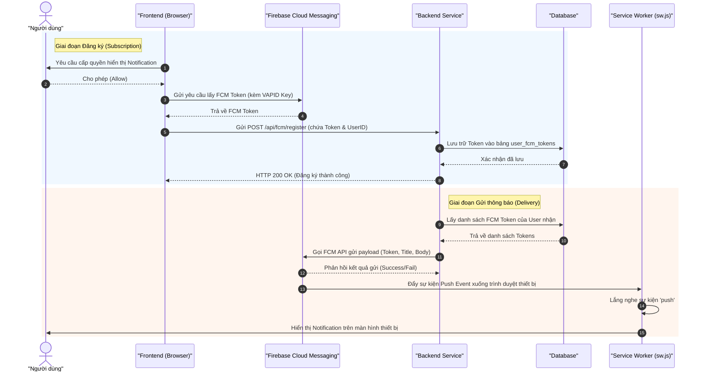
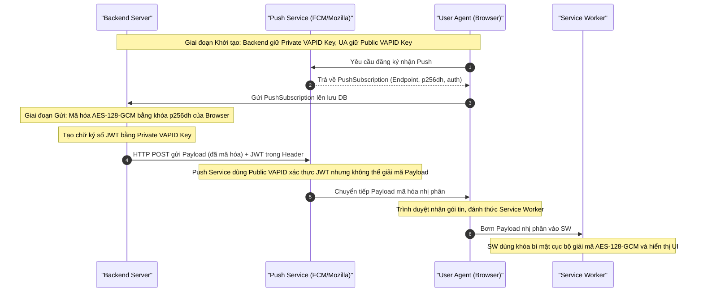
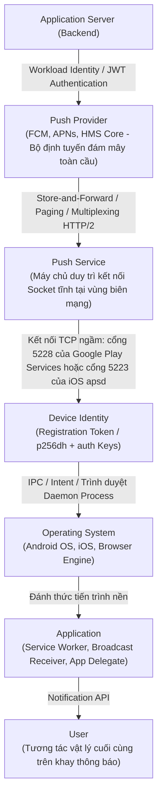

# Kiến Trúc Web Notifications

Tài liệu này nghiên cứu sâu về kiến trúc luồng dữ liệu, giao thức bảo mật mật mã hóa và cách thức quản lý thực thể thiết bị trong hệ thống Web Notifications.

## Mục lục

*   [1. Luồng hoạt động Firebase Cloud Messaging (FCM)](#1-luồng-hoạt-động-firebase-cloud-messaging-fcm)
*   [2. Kiến trúc Web Push API tiêu chuẩn](#2-kiến-trúc-web-push-api-tiêu-chuẩn)
*   [3. Bảo mật và Mật mã hóa (Zero-Trust)](#3-bảo-mật-và-mật-mã-hóa-zero-trust)
*   [4. Nhận diện thiết bị (Device Identity)](#4-nhận-diện-thiết-bị-device-identity)
*   [5. Độ tin cậy và Xử lý lỗi hệ thống](#5-độ-tin-cậy-và-xử-lý-lỗi-hệ-thống)
*   [6. Mô hình đường ống tổng quát (Pipeline)](#6-mô-hình-đường-ống-tổng-quát-pipeline)

---

## 1. Luồng hoạt động Firebase Cloud Messaging (FCM)

FCM đóng vai trò như một **bưu điện trung gian** giúp định tuyến tin nhắn đẩy từ Backend Service của ứng dụng tới các thiết bị khách thông qua cơ chế đăng ký Token và Service Worker.

### Sơ đồ luồng đăng ký và gửi tin (FCM Sequence Diagram)

### Giải thích các bước trong luồng FCM

| Thành phần/Bước | Vai trò/Mô tả | Chi tiết |
| :--- | :--- | :--- |
| **Giai đoạn Đăng ký (1-8)** | Xin quyền và Lưu trữ Token | Trình duyệt yêu cầu người dùng cho phép hiển thị thông báo. Khi được chấp thuận, Frontend gọi thư viện FCM SDK để sinh ra một Registration Token (độc nhất cho cặp thiết bị + app) dựa trên VAPID Key, sau đó gửi lên Backend để lưu giữ dưới cơ sở dữ liệu. |
| **Giai đoạn Gửi (9-15)** | Gửi tin nhắn đẩy bất đồng bộ | Khi có sự kiện mới, Backend lấy danh sách Token của người dùng từ Database, gọi FCM HTTP v1 API. FCM đảm nhận vai trò định tuyến, gửi gói tin tới tiến trình chạy ngầm Service Worker trên thiết bị, và hiển thị thông báo ra màn hình. |

---

## 2. Kiến trúc Web Push API tiêu chuẩn

Web Push là sự hội tụ của một loạt các tiêu chuẩn giao thức mạng mở được định nghĩa bởi IETF và W3C (như RFC 8030 cho giao thức đẩy chung, RFC 8292 cho xác thực VAPID và RFC 8291 cho mã hóa gói tin).

### Các thực thể cốt lõi trong kiến trúc:

1.  **Browser (Trình duyệt):** Môi trường thực thi ứng dụng Web, chịu trách nhiệm quản lý quyền riêng tư, lưu trữ khóa mật mã cục bộ, vẽ giao diện và tương tác với hệ điều hành.
2.  **Push Service (Dịch vụ đẩy mạng):** Máy chủ đám mây do nhà sản xuất trình duyệt vận hành (Ví dụ: Mozilla Push Service cho Firefox, FCM cho Chrome, APNs cho Safari). Trách nhiệm của nó là định tuyến và chuyển tiếp các gói tin mã hóa nhị phân xuống client. Nó hoàn toàn "mù" với nội dung tin nhắn.
3.  **Service Worker:** Một kịch bản JavaScript chạy độc lập trên luồng nền (*background thread*), hoạt động độc lập với sự tồn tại của tab ứng dụng Web. Nó là thực thể duy nhất lắng nghe sự kiện `'push'` từ hệ điều hành trình duyệt.
4.  **Web Application Backend:** Máy chủ ứng dụng của bạn, chịu trách nhiệm lưu trữ các PushSubscription, quản lý các cặp khóa mật mã và phát lệnh gửi tin.

---

## 3. Bảo mật và Mật mã hóa (Zero-Trust)

Kiến trúc Web Push bắt buộc tuân theo triết lý Zero-Trust thông qua hai chuẩn mật mã hóa nghiêm ngặt:

| Thành phần/Bước | Vai trò/Mô tả | Chi tiết |
| :--- | :--- | :--- |
| **Mã hóa Payload (RFC 8291)** | AES-128-GCM | Backend dùng khóa công khai `p256dh` thu được từ trình duyệt khách để mã hóa nội dung. Push Service trung gian chỉ đóng vai trò truyền dẫn mà không thể giải mã nội dung. |
| **Xác thực VAPID (RFC 8292)** | Xác thực nguồn gốc gửi | Backend ký một JWT bằng Private VAPID Key của mình đặt vào tiêu đề HTTP request. Push Service dùng Public VAPID Key để đối chiếu chữ ký, ngăn chặn hành vi giả mạo backend để spam thiết bị. |

---

## 4. Nhận diện thiết bị (Device Identity)

Trong hệ thống Notification, **Registration Token** (hoặc Push Subscription) đại diện duy nhất cho **một thiết bị vật lý cụ thể kết hợp với một ứng dụng cài đặt cụ thể**. Một tài khoản người dùng (`user_id`) có thể sở hữu nhiều thiết bị hoạt động song song.

> [!CAUTION]
> Tuyệt đối không thiết kế cơ sở dữ liệu bằng cách gắn cột `push_token` trực tiếp vào bảng `Users`. Thiết kế này sẽ gây ra lỗi ghi đè token khi người dùng đăng nhập thiết bị mới, khiến các thiết bị cũ bị mất kết nối thông báo.

### Thiết kế Cơ sở dữ liệu Chuẩn mực cho Device Identity

| Cột | Kiểu dữ liệu | Ràng buộc | Vai trò trong Kiến trúc |
| :--- | :--- | :--- | :--- |
| `id` | BigInt | Primary Key | Định danh bản ghi nội bộ. |
| `user_id` | BigInt | Foreign Key | Liên kết với tài khoản người dùng thực thể (1 người dùng -> N thiết bị). |
| `push_token` | Text | Unique | Khóa định tuyến (FCM Token / Web Subscription JSON). |
| `device_identifier`| Varchar | Unique | Chuỗi mã phần cứng (như UUID) ngăn chặn cấp phát trùng lặp cho cùng một máy. |
| `device_type` | Varchar | Not Null | Phân loại thiết bị (`chrome`, `safari`, `ios`, `android`). |
| `last_seen_at` | Timestamp | Not Null | Đánh dấu thời điểm hoạt động cuối cùng để chạy cronjob tự động dọn dẹp các token rác (> 30 ngày). |

---

## 5. Độ tin cậy và Xử lý lỗi hệ thống

Các dịch vụ đẩy mạng vận hành theo triết lý **Best Effort Delivery** (Nỗ lực phân phối tối đa). Không một nhà cung cấp nào cam kết tỷ lệ nhận tin 100%.

### Nguyên nhân gây suy hao và thất thoát thông điệp (Message Loss):
1.  **Thiết bị Ngoại tuyến (Offline):** Khi thiết bị mất sóng hoặc tắt nguồn, kết nối TCP bị phá vỡ. Gói tin được chuyển vào hàng đợi lưu trữ tạm thời (*Store-and-Forward*).
2.  **Thời gian sống của tin nhắn (TTL):** Nếu thiết bị offline lâu hơn cấu hình Time-To-Live (tối đa 28-30 ngày), tin nhắn sẽ bị xóa sạch khỏi hàng đợi của Provider.
3.  **Giới hạn Hàng đợi (Queue Limits):** FCM chỉ lưu giữ tối đa 100 tin nhắn đang chờ xử lý cho một thiết bị ngoại tuyến. Giải pháp là sử dụng kỹ thuật tin nhắn có thể thu gọn bằng cách khai báo `collapse_key` (FCM) hoặc `apns-collapse-id` (APNs).
4.  **Hệ điều hành Chặn (OS blocks):** Các chế độ bảo vệ pin nghiêm ngặt (như Doze Mode của Android hay Rate Limits của iOS Silent Push) có thể trì hoãn hoặc tiêu diệt trực tiếp tiến trình nhận tin ngầm.

### Bảng Hệ thống mã lỗi trạng thái khi suy hao tại APNs/FCM HTTP/2

| Mã lỗi HTTP | Cờ Trạng thái (Error String) | Hành vi Khắc phục (Resolution) |
| :--- | :--- | :--- |
| **400 / 404** | `BadDeviceToken` / `BadPath` | Gói tin hỏng cấu trúc hoặc Token sai định dạng. Hủy bỏ gửi ngay lập tức, không thử lại. |
| **410 Gone** | `Unregistered` / `ExpiredToken` | Thiết bị đã gỡ cài đặt ứng dụng hoặc tắt quyền thông báo. **Bắt buộc gọi lệnh XÓA bản ghi Token tương ứng khỏi cơ sở dữ liệu ngay lập tức**. |
| **413** | `PayloadTooLarge` | Kích thước cấu trúc payload vượt quá giới hạn 4KB. Cần tiến hành cắt gọt bớt dữ liệu thô. |
| **429** | `TooManyRequests` | Vượt giới hạn quota gửi hoặc nghẽn mạng tạm thời. Áp dụng cơ chế Backoff. |
| **500 / 503** | `InternalServerError` | Máy chủ đám mây của Provider bảo trì. Phải tôn trọng tiêu đề HTTP `Retry-After` và áp dụng thuật toán **Exponential Backoff với Jitter**. |

---

## 6. Mô hình đường ống tổng quát (Pipeline)

Xuyên suốt mọi công nghệ thông báo từ trước tới nay, luồng đi của dữ liệu luôn tuân thủ mô hình đường ống trừu tượng phân lớp:

Nắm vững mô hình này giúp lập trình viên nhanh chóng làm quen với bất kỳ nền tảng thông báo mới nào, chỉ cần ánh xạ các khái niệm tương đương của nền tảng đó vào đường ống chung này.

---
[← Quay lại mục lục](README.md)
